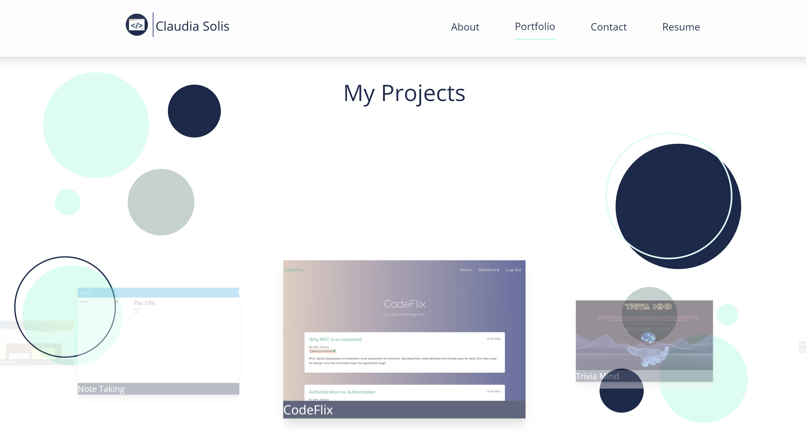

# My Portfolio

  ## Description
 This react application is a single page application demonstrating my portfolio of all the work I have created.

  ## Table of Contents
  * [Installation](#installation)
  * [Usage](#usage)
  * [Credits](#credits)
  * [License](#license)
  * [How to Contribute](#how-to-contribute)
  * [Tests](#tests)
  * [Questions](#questions)
  
  ## Installation
  N/A

  ## Usage
  Repo: https://github.com/cjsolis12/portfolio-site.git
  Deployed app: https://portfolio-site-a5a1echl6-cjsolis12.vercel.app/resume 

  ## Credits

  - Gradient css background : https://cssgradient.io/    
  - [https://getbootstrap.com/docs   ](https://tailwindui.com/components)
  - https://freefrontend.com/tailwind-feature-sections/
  -[ https://mdbootstrap.com/docs ](https://react-icons.github.io/react-icons/)
  - https://svghub.vercel.app/
  

  ## How to Contribute
  N/A

  ## Tests
  N/A

  ## Questions
  Questions about this app?  
  GitHub: https://github.com/cjsolis12  
